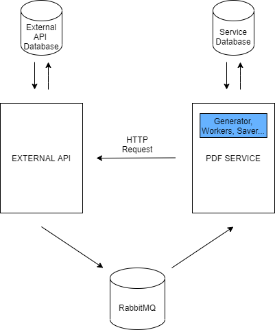

# nodejs-pdf-service

A simple Node.js PDF service built with [RabbitMQ](https://www.rabbitmq.com) and [jsPDF](https://github.com/MrRio/jsPDF).

<div align="center">
  <br>
  
  <br><br>
</div>

## Get started

1. Run the following command to create the necessary docker containers to run this project:
```
$ docker-compose up
```

2. Create a file named `.env` in the root of the project with the variables defined in `.env.example`.

3. Create a database called `pdf` and run the following command to run the migrations:
```
$ yarn migrate
```

4. Install dependencies:
```
$ yarn install
```

5. Start the service:
```
$ yarn start
``` 

You can also start the service in `dev` mode with hard reload:
```
$ yarn dev
```

### Instructions

Main data JSON structure needed to generate a PDF:

```
{
  "id": "",           // uuid
  "logo": "",         // base64
  "header": "",       // string
  "description": "",  // string
  "items": []
}
```

Items property is and array of items which are defined below.

- Table
```
{
  "type": "table",
  "header": "",       // string
  "description": "",  // string
  "fields": [],       // string[]
  "items": []         // related to fields (example below)
}
```

Example table item:

```json
{
  "type": "table",
  "header": "Lorem ipsum",
  "description": "Lorem ipsum dolor sit amet, consectetur adipiscing elit, sed do eiusmod tempor incididunt ut labore et dolore magna aliqua.",
  "fields": ["foo", "bar"],
  "items": [
    {
      "foo": "lorem",
      "bar": "ipsum"
    },
    {
      "foo": "dolor",
      "bar": "sit"
    }
  ]
}
```
